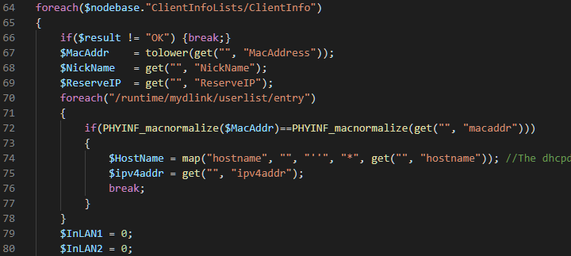
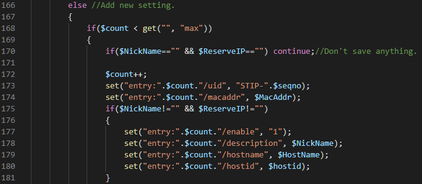
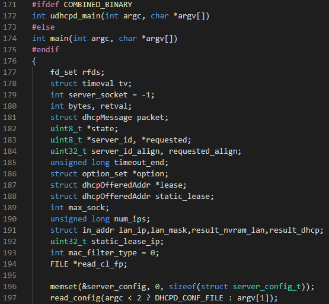
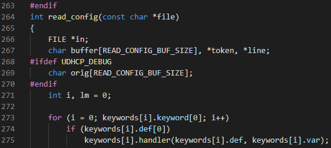
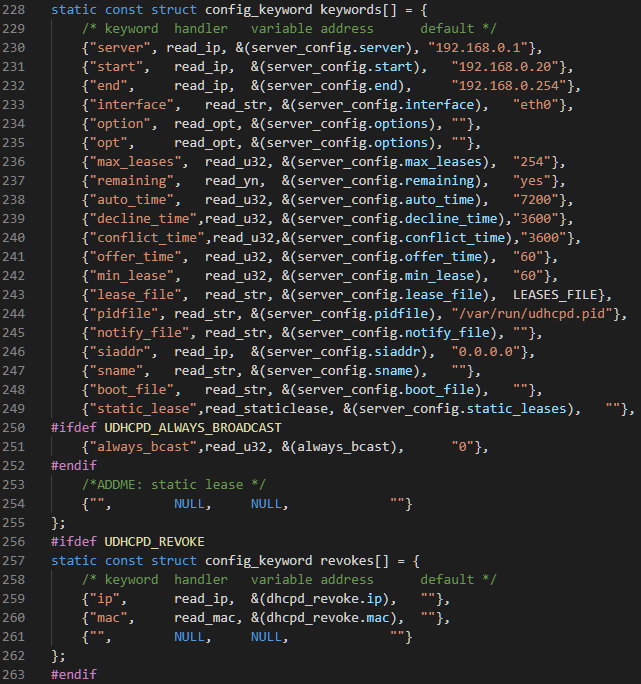
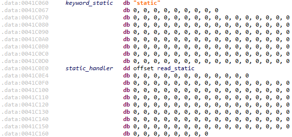
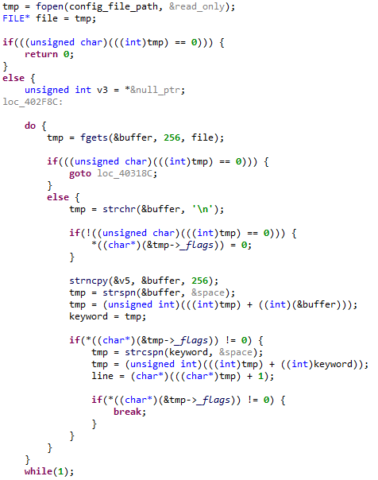
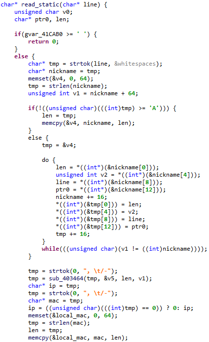

# D-Link Buffer Overflow vulnerability

**Exploit Author**: pr0v3rbs@kaist.ac.kr

**Vender**: D-Link

**Firmware version**:
DIR822B1 - 202KRb06

**Hardware Link**:
http://www.mydlink.co.kr/2013/beta_board/product_detail.php?no=205&model=DIR-822

## The detail of vulnerability ##

In the `/HNAP1/SetClientInfo` message, the `MacAddress` element trigger buffer overflow vulnerablity, and the vulnerability affects D-Link DIR-822 B1 202KRb06 device. The xml structure of `/HNAP1/SetClientInfo` message likes below.

```
<?xml version="1.0" encoding="utf-8"?>
<soap:Envelope xmlns:xsi="http://www.w3.org/2001/XMLSchema-instance" xmlns:xsd="http://www.w3.org/2001/XMLSchema" xmlns:soap="http://schemas.xmlsoap.org/soap/envelope/">
<soap:Body>
<SetClientInfo>
        <ClientInfoLists>
                <ClientInfo>
                        <MacAddress></MacAddress>
                        <NickName></NickName>
                        <ReserveIP></ReserveIP>
                </ClientInfo>
        </ClientInfoLists>
</SetClientInfo>
</soap:Body>
</soap:Envelope>
```

In the `SetClientInfo.php` source code, the `MacAddress` element is saved in the `"entry:".$count."/macaddr"` internal configuration memory without any regex checking.



...



Then, the client information is saved in the `/var/servd/LAN-1-udhcpd.conf` file and if we send a large string such as 'a'*1000 in `MacAddress` element, the configuration file will like below.

```
remaining no
start 192.168.0.100
end 192.168.0.199
interface br0
lease_file /var/servd/LAN-1-udhcpd.lease
pidfile /var/servd/LAN-1-udhcpd.pid
force_bcast no
opt subnet 255.255.255.0
opt router 192.168.0.1
opt dns 192.168.0.1
opt lease 604800
dhcp_helper event UPDATELEASES.LAN-1
static '' 192.168.0.11 aaaaaaaaaaaaaaaaaaaaaaaaaaaaaaaaaaa...
```

Finally, the `/var/servd/DHCPS4.LAN-1_start.sh` script executes `udhcpd /var/servd/LAN-1-udhcpd.conf &` command and in the `udhcpd` program, buffer overflow occur.

Before reverse engineering the `udhcpd` program, I referenced similar [source code](ftp://ftp.d-link.co.za/D-LinkFTP/products/GPL/DIR-825_revB/DIR-825-B1-GPLSourceCode_.gz) which is found by googling to draw brief structure of the program.

First, `read_config` function of `udhcpd` program set keyword handler to parse keywords in the configuration file.





From the D-Link (AthSDK/apps/udhcp/files.c) source code, I could see keyword handler array as likes below, however I could not found `"static"` keyword.



Therefore, I found a function which parses `"static"` keyword line from `udhcpd` program in the firmware, and I named it `read_static`.



Before calling the handler function, in the `read_config` function, it reads 256 bytes for the each line.



And then, the `read_config` function runs `keywords[i].handler(line, keywords[i].var)` code.

`read_static` function parses `line` parameter string which is after from `"static"` keyword in the line and stores mac string into local mac buffer which is 100 bytes size.



Finally, when returning from the `read_static` function, the program will be crash due to the overflowed buffer.